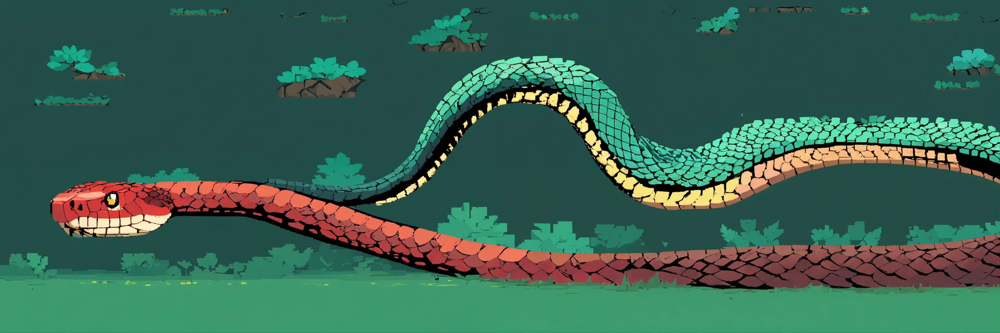

# Snake Game

This is a classic arcade-style Snake game implemented in Python using the Turtle graphics library. The game features smooth gameplay, dynamic scoring, and simple controls. It's an excellent example of a beginner Python project involving basic game development concepts.

## Table of Contents

- [Overview](#overview)
- [Features](#features)
- [Prerequisites](#prerequisites)
- [Game Controls](#game-controls)
- [Gameplay](#gameplay)
- [License](#license)

## Overview

The Snake Game is a timeless classic where the player controls a snake to eat food that randomly appears on the screen. Each piece of food eaten increases the snake's length and the player's score. The game ends if the snake collides with the screen borders or its own body.

## Features

- **Classic Gameplay**: Traditional snake mechanics with smooth controls.
- **Dynamic Scoring**: Real-time score and high score tracking.
- **Pause/ Resume and Exit**: Ability to pause, resume and exit the game.
- **Simple Interface**: Clean and minimalistic design.

## Prerequisites

- Python 3.x installed on your system.
- Turtle graphics library (comes standard with Python).
  
## Game Controls

- **W**: Move Up
- **S**: Move Down
- **A**: Move Left
- **D**: Move Right
- **Space**: Pause/Resume Game
- **Escape**: Exit Game

## Gameplay

1. **Objective**: Control the snake to eat food and grow longer. Avoid collisions with the screen borders and the snake's own body.
2. **Scoring**: Each piece of food increases the score by 10 points. The game keeps track of the highest score achieved during the session.
3. **Game Over**: The game ends when the snake collides with the border or itself. The snake resets, and the current score resets to zero.

## License

This project is licensed under the MIT License. See the [LICENSE](LICENSE) file for details.
